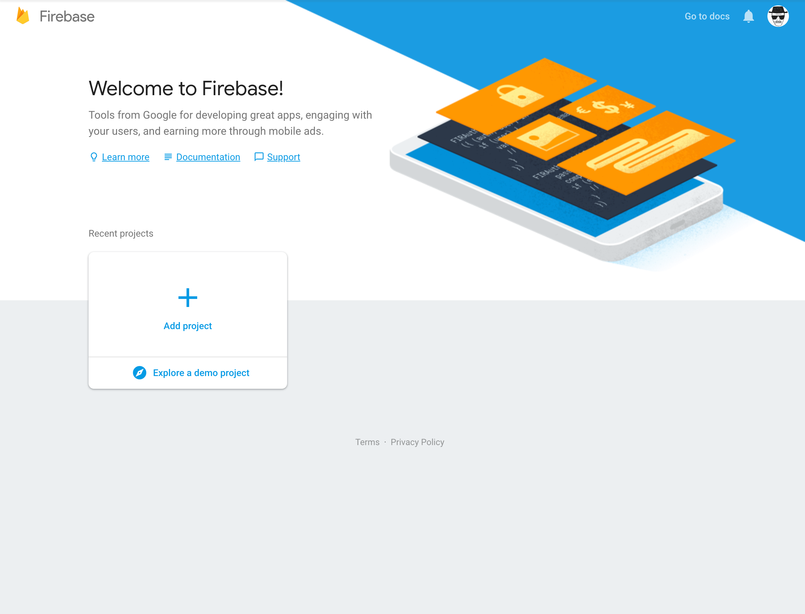
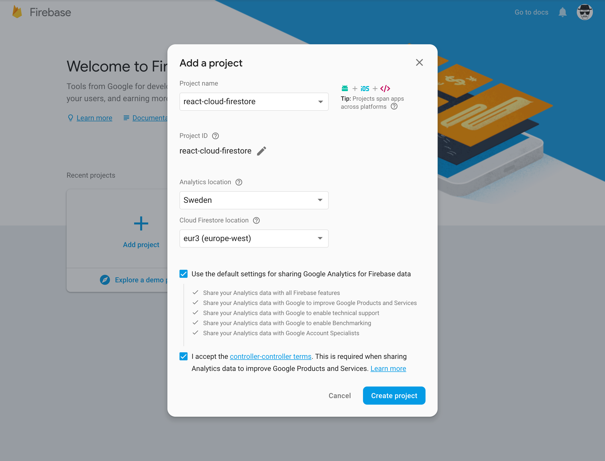
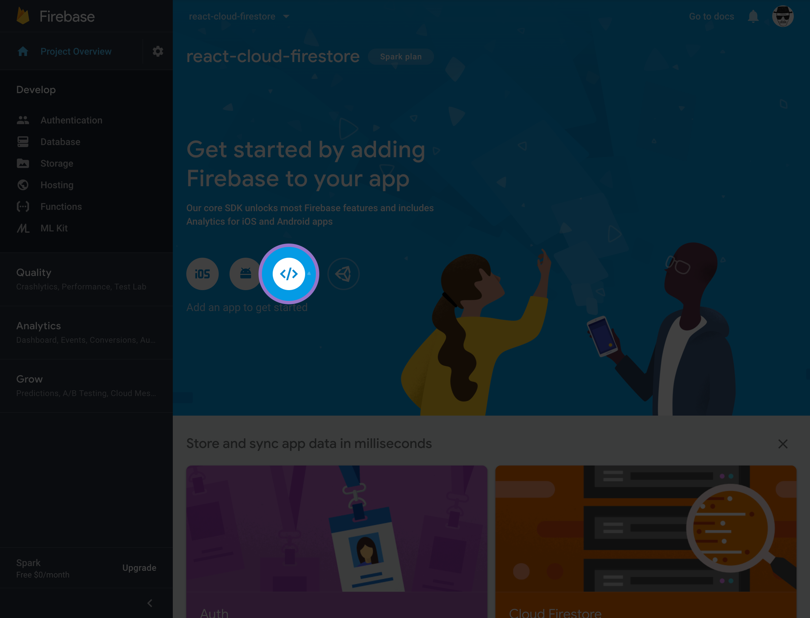
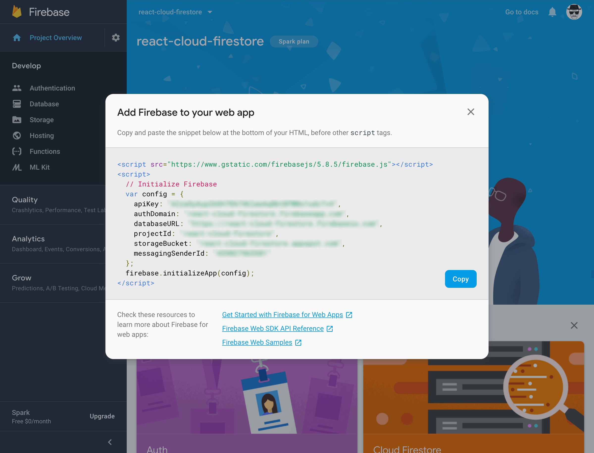
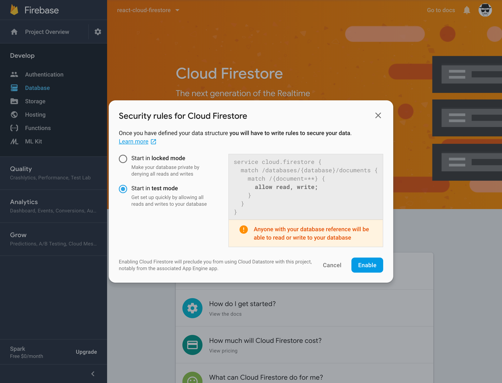
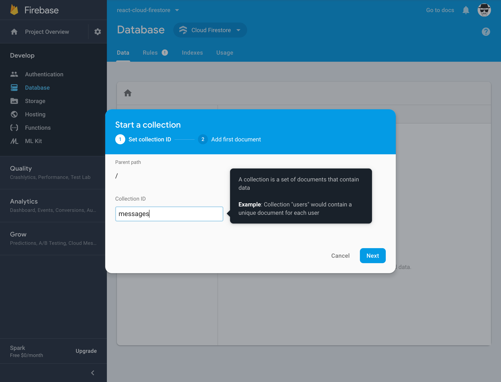
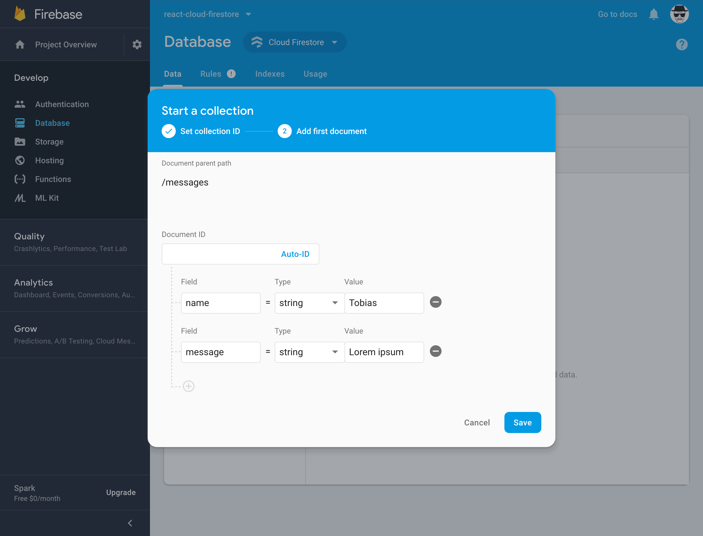
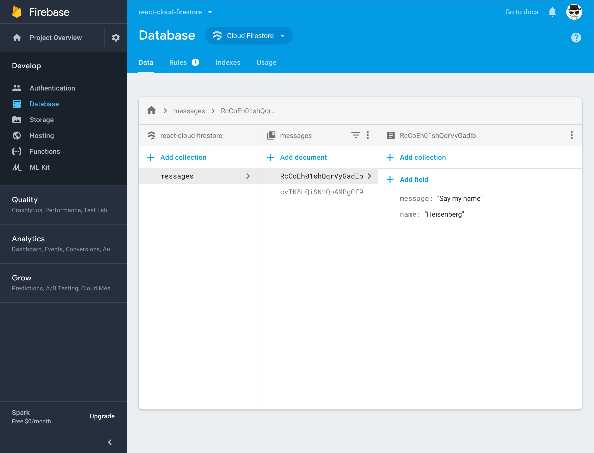

## Lets start off with explaining Cloud Firestore

As of January 31, 2019 Cloud Firestore is no [longer in beta](https://cloud.google.com/blog/products/databases/announcing-cloud-firestore-general-availability-and-updates).
In their own words:

> Cloud Firestore is a flexible, scalable database for mobile, web,
> and server development from Firebase and Google Cloud Platform.
> Like Firebase Realtime Database, it keeps your data in sync across
> client apps through realtime listeners and offers offline support
> for mobile and web so you can build responsive apps that work
> regardless of network latency or Internet connectivity. Cloud
> Firestore also offers seamless integration with other Firebase
> and Google Cloud Platform products, including Cloud Functions.

## How can we use this?

We're going to create the most simple chat application with React
and Cloud Firestore. The user will be able to fill out a form
containing their name and a message. When submitted it will end
up in Cloud Firestore and realtime update throughout all clients.
For a simple start I've used [Create React App](https://github.com/facebook/create-react-app),
I recommend you to do the same.

We need to add one package for this application to work, and that's
the `firebase` package. Yes, it's supposed to say "firebase" and not
"firestore", you'll see why later on.

```jsx
yarn add firebase
```

## Create our database 💪

Head over to the [Firebase](https://firebase.google.com/) website and
click the *"Get started"* button. You'll then end up on this page:



Select the *"Add project"* card to create your project. A modal with
appear with some neccessary information you need to fill out. Here
below you have an example of my information for this application:



When you're done you can hit the *"Create project"* button. Next up
you'll land on the overview page and here you're supposed to click on
the circle with `</>`. See image below:



When you have clicked the circle a modal with appear with your config.
Something like this:



### Add config to React

We need to append this config in our React project, so lets do that.
Copy everything within the last `<script>` tags. Now head back to your
code and create a new folder within *src* that's called *config*.
Within *config* you can create a file named `firestore.js`.

Open `firestore.js` and import the necessary packages. Then you'll
append your config and export the firestore. It can look something
like this:

```jsx
import firebase from 'firebase/app';
import 'firebase/firestore';

const config = {
  apiKey: 'xxxxxxxxxxxxxxxxxxxxxxxxxxxxxxxxxxxxxxx',
  authDomain: 'PROJECT-NAME.firebaseapp.com',
  databaseURL: 'https://PROJECT-NAME.firebaseio.com',
  projectId: 'PROJECT-NAME',
  storageBucket: 'PROJECT-NAME.appspot.com',
  messagingSenderId: 'xxxxxxxxxxxx'
};
firebase.initializeApp(config);

export default firebase.firestore();
```

### Continue with the database

Go back to the Firebase setup and close the config modal. Click
*"Database"* in the left panel below *"Develop"*. Select
*"Create database"* below Cloud Firestore as you can see below:


A modal will appear asking for security rules. This is very important
when you go into production. But for this showcase we'll be using
*"test mode"* because we're in development mode.



Once enabled we can see our empty database. Select *"+ Add collection"*
and enter **messages** as our Collection ID. As the authors explains it,
a collection is a set of documents that contain data.



Once the collection is created we can add our first document to it. Our
document will contain two things, the users name and the message. So you
can create this as I've done below and then hit *"Save"*:



You've now populated your database with some data. Good job. It should
look something like this:


We're finally done with the database setup. Now it's time for the fun part,
integrate Cloud Firestore with React 😍

## Integrate Cloud Firestore with React 🍿

For this application to work we need two components, a list of messages
and a form that adds a message. Lets kick off with the list component.

### List of messages

First thing this component need to do is listen for changes in our
Firestore database, so when the compontent mounts we'll trigger this
listener. The response from our database will be kept in the `messages`
state.

```jsx
import React, { useState, useEffect } from 'react';
import firestore from './config/firestore';

const Messages = () => {
  // Set default as null so we
  // know if it's still loading
  const [messages, setMessages] = useState(null);

  // Initialize with listening to our
  // messages collection. The second argument
  // with the empty array makes sure the
  // function only executes once
  useEffect(() => {
    listenForMessages();
  }, []);

  // Use firestore to listen for changes within
  // our newly created collection
  const listenForMessages = () => {
    firestore.collection('messages').onSnapshot(
      (snapshot) => {
        // Loop through the snapshot and collect
        // the necessary info we need. Then push
        // it into our array
        const allMessages = [];
        snapshot.forEach((doc) => allMessages.push(doc.data()));

        // Set the collected array as our state
        setMessages(allMessages);
      },
      (error) => console.error(error)
    );
  };
};

export default Messages;
```

Now we always will have our messages stored within the messages state as
an array. Lets continue and render the messages to the screen:

```jsx
const Messages = () => {
  ...

  // If the state is null we
  // know that it's still loading
  if (!messages) {
    return <div>Loading...</div>;
  }

  // Render all the messages with no
  // specific order
  const renderMessages = () => {
    // If the array is empty we inform
    // the user that there's no messages
    if (!messages.length) {
      return <div>There's no messages yet...</div>;
    };

    // Otherwise we'll render the messages.
    // Using index as key 🙈
    return messages.map(({ name, message }, index) => (
      <div key={index}>
        <b>{name}</b>
        <div>{message}</div>
      </div>
    ));
  };

  // Render messages
  return renderMessages();
};

export default Messages;
```

Great, now we can see our document we added earlier in the Cloud Firestore
dashboard. Next up we need to be able to add more messages. Lets add this
component to our `Messages.js` before we even create it. So the complete
messages component should look like this:

```jsx{3,66}
import React, { useState, useEffect } from 'react';
import firestore from './config/firestore';
import Form from './Form'; // This one is new

const Messages = () => {
  // Set default as null so we
  // know if it's still loading
  const [messages, setMessages] = useState(null);

  // Initialize with listening to our
  // messages collection. The second argument
  // with the empty array makes sure the
  // function only executes once
  useEffect(() => {
    listenForMessages();
  }, []);

  // Use firestore to listen for changes within
  // our newly created collection
  const listenForMessages = () => {
    firestore.collection('messages').onSnapshot(
      (snapshot) => {
        // Loop through the snapshot and collect
        // the necessary info we need. Then push
        // it into our array
        const allMessages = [];
        snapshot.forEach((doc) => allMessages.push(doc.data()));

        // Set the collected array as our state
        setMessages(allMessages);
      },
      (error) => console.error(error)
    );
  };

  // If the state is null we
  // know that it's still loading
  if (!messages) {
    return <div>Loading...</div>;
  }

  // Render all the messages with no
  // specific order
  const renderMessages = () => {
    // If the array is empty we inform
    // the user that there's no messages
    if (!messages.length) {
      return <div>There's no messages yet...</div>;
    }

    // Otherwise we'll render the messages.
    // Still using index as key 🙈
    return messages.map(({ name, message }, index) => (
      <div key={index}>
        <b>{name}</b>
        <div>{message}</div>
      </div>
    ));
  };

  // Show the messages and form
  return (
    <>
      <Form /> {/* This one is new */}
      {renderMessages()}
    </>
  );
};

export default Messages;
```

### Add a message

It's time to create the `Form.js` component that we imported above. This
component doesn't need to do anything when it mounts, but it has to communicate
with firestore when the form is submitted. We'll store the form values within
our `item` state and when it's submitted we send it to our firestore collection.
First up we can build our form and it should look something like this:

```jsx
import React, { useState } from 'react';

const Form = () => {
  // Initial item contains empty strings
  // with the name and message
  const initialItemValues = {
    name: '',
    message: ''
  };
  const [item, setItem] = useState(initialItemValues);

  // Will be executed when the form is submitted
  const onSubmit = (event) => event.preventDefault();

  // Set the value for the current
  // element within our state
  const onChange = ({ target }) => {
    setItem({
      ...item,
      [target.name]: target.value
    });
  };

  return (
    <form onSubmit={onSubmit}>
      <input
        type="text"
        name="name"
        placeholder="Name"
        value={item.name}
        onChange={onChange}
      />
      <textarea
        name="message"
        placeholder="Message"
        value={item.message}
        onChange={onChange}
      />
      <button type="submit">Send</button>
    </form>
  );
};

export default Form;
```

Now when that's up and running we only need to send this information to our
firestore database. As you probably have figured out we're going to execute
that in our `onSubmit` function. So lets import firestore and execute it:

```jsx{2}
import React, { useState } from 'react';
import firestore from './config/firestore'; // This one is new

const Form = () => {
  // Initial item contains empty strings
  // with the name and message
  const initialItemValues = {
    name: '',
    message: ''
  };
  const [item, setItem] = useState(initialItemValues);

  // Will be executed when the form is submitted.
  // If the name and message has some length
  // we'll send the object to our firestore
  // collection as a document. Then we clear the
  // item state when it has succeeded
  const onSubmit = (event) => {
    event.preventDefault();

    // These lines are new
    if (item.name.length && item.message.length) {
      firestore
        .collection('messages')
        .doc()
        .set(item)
        .then(() => setItem(initialItemValues))
        .catch((error) => console.error(error));
    }
  };

  // Set the value for the current
  // element within our state
  const onChange = ({ target }) => {
    setItem({
      ...item,
      [target.name]: target.value
    });
  };

  return (
    <form onSubmit={onSubmit}>
      <input
        type="text"
        name="name"
        placeholder="Name"
        value={item.name}
        onChange={onChange}
      />
      <textarea
        name="message"
        placeholder="Message"
        value={item.message}
        onChange={onChange}
      />
      <button type="submit">Send</button>
    </form>
  );
};

export default Form;
```

## Time to test our chat 💬

Fill out the form and submit it. If you have followed the guide correctly a
new document should have been appended to your collection. When submitted the
message should've automatically appeared in your `Messages.js` component. You
can also see in the database dashboard if everything looks as it should.



## Wrap it up 🌯

This is a good start for understanding Cloud Firestore. Feel free to make this
application more advanced, you can for example make it possible to edit and
delete messages.

Remember that this application is very straightforward. It doesn't handle errors
and has no styling. And most important the database is in *test mode*. So before
you go into production you may want to take these things into consideration

Hope you've learned something. Here you can continue reading about Cloud Firestore
at their [documentation](https://firebase.google.com/docs/firestore/quickstart) 🎉
