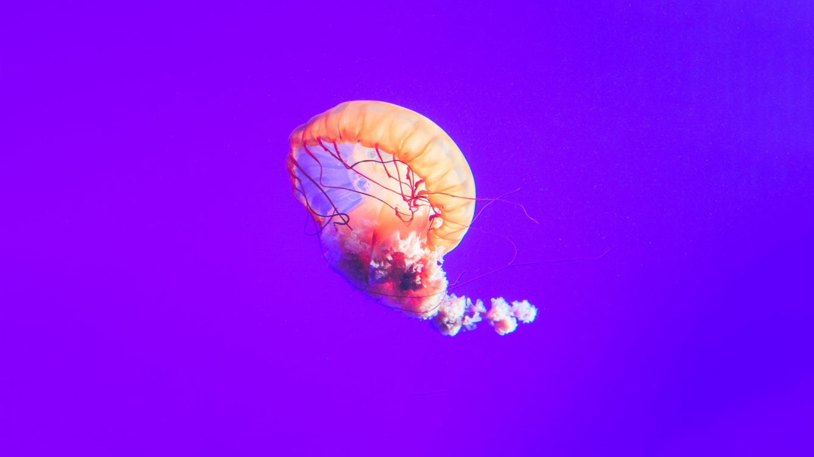
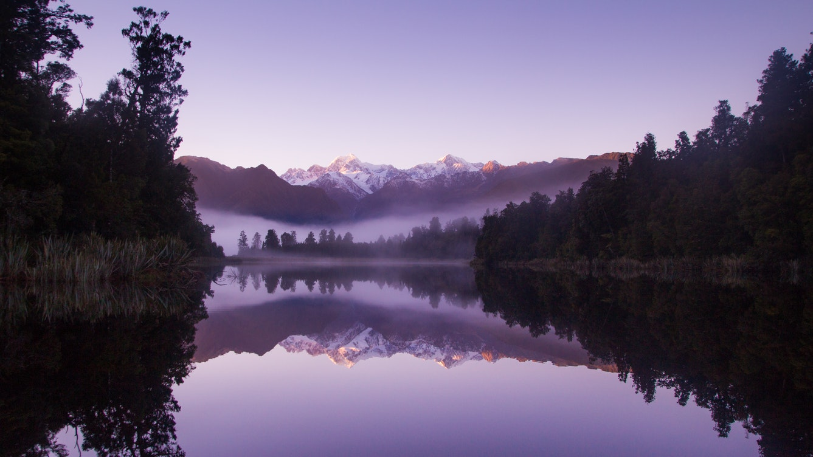

## What is Unsplash? 🧐

Unsplash started as a simple tool for creators. The concept was born
from the pain they had in finding great, usable imagery. Unsplash is
a platform fueled by a community that has generously gifted hundreds
of thousands of their own photos.

## Make use of Unsplash Source

Using [Unsplash Source](https://source.unsplash.com/) is the most
easiest way of integrating their API in your application.

> Source is built for use in small, low-traffic applications. For
> production uses, we recommend the official Unsplash API which has
> more robust features and supports high-traffic use cases.

## Specific photo 🌄

To get a specific photo, simply append its photo id to the URL. The
photo id can be found in the address bar in the standalone photo page.
For example you can see that [https://unsplash.com/photos/KLbUohEjb04](https://unsplash.com/photos/KLbUohEjb04)
has the id of `KLbUohEjb04`. You can also define a specific size:

```jsx
https://source.unsplash.com/{PHOTO_ID}/{WIDTH x HEIGHT}
```

So with both the photo id and the image size it could look something
like this:

```html
https://source.unsplash.com/KLbUohEjb04/1337x752
```



## Random search term 🔍

You can select a more random photo within a specific selection. Narrow
the selection by supplying a list of comma-separated search terms at
the end of the URL:

```jsx
https://source.unsplash.com/{WIDTH x HEIGHT}/?{KEYWORD},{KEYWORD}
```

With search terms of `purple` & `nature` and the size of `1337x752` it
would look like this:

```html
https://source.unsplash.com/1337x752/?purple,nature
```

If you'd like to limit the results to only those photos included in our
curated collections, simply add featured at the end of the URL.

If you don't want to define a specific size you could limit the results
to only those photos included in their curated collections. Just replace
`1337x752` with `featured`:

```html
https://source.unsplash.com/featured/?purple,nature
```



## Want to know more?

More details around simple integrations can be found [here](https://source.unsplash.com/).
For a more advanced integration, check out the full API at their [developers page](https://unsplash.com/developers/).
